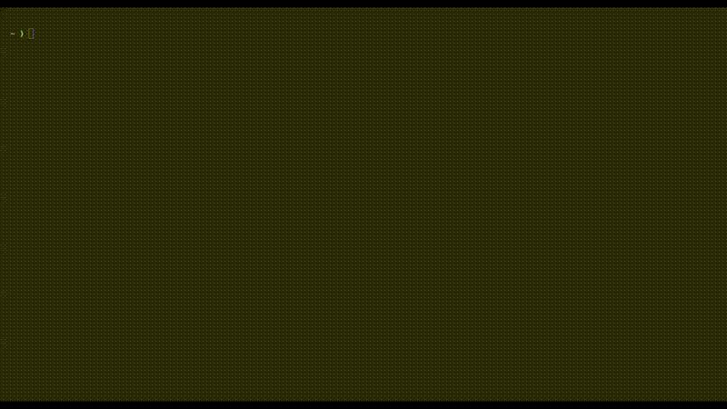

# solo

A fast terminal-based project picker that launches tmux sessions for agent tools.



## Features

- Fuzzy search across project containers (directories with git worktrees)
- Git worktree selection and branch creation
- Create new projects with a default `main` worktree backed by a bare repo
- Launch tmux sessions running `opencode` or `amp`
- Keyboard-driven navigation
- Theme picker for customizing the UI

## Prerequisites

- tmux
- git
- `opencode` and/or `amp` on your PATH

## Installation

```bash
go install github.com/ariguillegp/solo/cmd/solo@latest
```

## Usage

```bash
solo [directories...]
```

Solo starts tools directly inside tmux sessions using your default shell, so no
login shell flags are required.

By default, solo scans `~/Work/tries`. Pass custom directories as arguments:

```bash
solo ~/projects ~/work
```

### Non-Interactive Launch

Open a session directly without the UI:

```bash
solo --project my-project --worktree main --tool opencode
```

`--project` can be a container name or an absolute path. `--worktree` can be an existing
worktree directory or a branch name; if it does not exist, solo creates it.

Create a new project non-interactively:

```bash
solo --project my-project --worktree main --tool opencode --create-project
```

### Configurable Tools

By default, solo offers `opencode` and `amp`. You can override the list with the
`SOLO_TOOLS` environment variable (comma or whitespace separated):

```bash
SOLO_TOOLS="amp,opencode,custom-agent" solo
```

This affects both the UI tool picker and `--tool` validation.

To create the tmux session without attaching (useful for scripts), add `--detach`.

### Theme Picker

Press `ctrl+t` to open the theme picker and choose from the available themes. The
selected theme updates UI colors across the app.

### Project Layout

Solo expects a project container that holds one worktree per directory:

```
my-project/
  .bare/
  main/
  feat-login/
  fix-bug/
```

The project directory itself stores a bare repo in `.bare`, while each worktree is a
separate directory. The `main` worktree is created without an initial commit.

Stale worktree references (from manually deleted directories) are automatically
pruned whenever the worktree list is loaded, keeping the list accurate.

### Keybinding Examples

Optional bindings to launch `solo` quickly:

**Bash**

```bash
bind -x '"\C-f": "solo"'
```

**Zsh**

```bash
bindkey -s '^f' 'solo\n'
```

**tmux**

```tmux
bind-key f run-shell "tmux has-session -t solo-launcher 2>/dev/null && tmux kill-session -t solo-launcher; tmux new-session -d -s solo-launcher 'bash -lc \"solo\"'; tmux switch-client -t solo-launcher"
```

This launches solo in a temporary tmux session to keep your current session clean.

### Workflow

1. Launch solo and type to fuzzy-filter project containers
2. Press `enter` to select a project (or create a new one)
3. Choose an existing worktree or type a branch name to create a new one
4. Select a tool (`opencode` or `amp`) to start the session

The fuzzy suggestion list shows up to five items at once and displays scroll
indicators when more suggestions are available.

### Keybindings

#### Project Selection

| Key | Action |
|-----|--------|
| `↑` / `ctrl+k` | Previous suggestion |
| `↓` / `ctrl+j` | Next suggestion |
| `enter` | Select project (go to worktree selection) |
| `ctrl+t` | Open theme picker |
| `esc` / `ctrl+c` | Quit |

#### Worktree Selection

| Key | Action |
|-----|--------|
| `↑` / `ctrl+k` | Previous worktree |
| `↓` / `ctrl+j` | Next worktree |
| `enter` | Select worktree / create new if typing |
| `ctrl+d` | Delete selected worktree (with confirmation) |
| `ctrl+t` | Open theme picker |
| `esc` | Go back to project selection |
| `ctrl+c` | Quit |

#### Tool Selection

| Key | Action |
|-----|--------|
| `↑` / `ctrl+k` | Previous tool |
| `↓` / `ctrl+j` | Next tool |
| `enter` | Start session |
| `ctrl+t` | Open theme picker |
| `esc` | Back to worktree selection |
| `ctrl+c` | Quit |

## License

MIT
